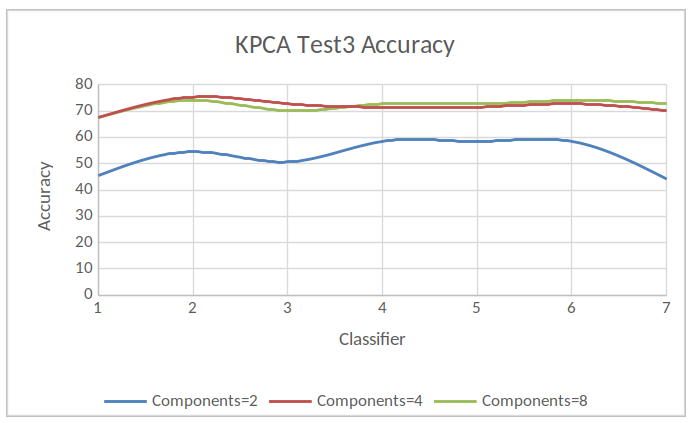

## Running the code
You can run the Cross Validation script in this directory using `./main.py`.

The scripts used to gather the primary data in the report are located under
the directory `Programs`. You can run those by entering those directories
and running `./main.py`. 

Requires `python3.6` or greater

------------------------------------------
# Motivation
Last election results are very interesting, and several states have surprising 
result . Most of the media had the wrong prectication. Moreover, in the last 
few years, the western countries have had several elections that have 
unexpected results too. We want to know if the same social values exist among 
western countries that would influence the election results.

# Problem
Can we use the data under following categories: Economics, Political 
affiliation (also known as political party), and Background or Social Media - 
to train a model which can use to predict the election results? Does the 
western world have similar social values that affect the elections? Is there a 
correlation between the results of elections and economics, background, or 
social media? 

We expect it is complicated project which involves a lot of 
features, data collecting, and pre-processing. We expect that our model can 
give us some idea about people’s preferences on the candidates and their raised
issues. If our model can also work on other western countries, then we may be 
able to conclude that the social values are same among some countries. 

This problem is a classification problem, where the election results are the
target. 

# Proposed Solution
We want to use our data to see if we can create a model to predict whether or 
not the republican candidate will win the election. We randomly picked 
Republican, our choice has nothing to do with our own affiliations. We are 
separating the election into only Republican and Democratic. A description of 
all our desired attributes/features is at the end of the document.

# Methodology

We tested our dataset using different classifiers (i.e. Perceptron, Decision 
Tree, KNN, Logistic Regression, SVM, and SGD) and compare their results.

We performed our tests without dimension reductions by changing different
parameters, followed by the same tests by using dimension reduction
techniques through modifying number of components.

For each test, we tested different classifiers on our data. The parameters were 
changed for the first three tests. We didn't use any dimension reduction 
techniques for those first three tests.

According to our notes from class, 
>The Fisher’s propose is used to maximize the distance between the mean of each class and minimize the spreading within the class itself. Thus, we come up with two measures: the within-class and the between-class. However, this formulation is only possible if we assume that the dataset has a Normal distribution. 

As you will see in the results section, our results shows a decrease in 
performance when using LDA. This means that the distribution of our data is 
primarily non-Gaussian.

To validate our model, we tried to get data from France as its governing
system is similar to the United States. However, the data was scarce and
we did not find enough of our feature or instances. We settled on just
analyzing the United States.

## Preprocessing Data
We had to find all our data for the US. We decided on the features before we
actually found the data, so we spent much time searching. Our data needed to
be for each state, for each election year. They also needed to include the 
election result for that state. The data was gathered in a separated state,
so they had to be combined. This can be seen in `transform_data.py`, with
the original datasets being in `datasets/`.

# Results

Our result data is stored in the directory `results/`. The file 
`cross_valid_results.docx` contains a second set of results used, ran
separately, used as cross validation data. You may also refer to that file 
when analyzing results. The subdirectory `Tests With Parameters/` contains
the parameters beside the result.

Our Runtime showed PCA to be the fastest in running time, while LDA was the 
slowest. KNN also had one of the quickest runtimes. You can see this in  
`results/runtimes.txt`

## Test1
### Parameters
```
per = Perceptron(n_iter=50, eta0=.1, random_state=1)

clf_entropy = DecisionTreeClassifier(criterion="entropy", random_state=1, max\_depth=5, min_samples_leaf=3)

knnn = KNeighborsClassifier(n_neighbors=9, metric='euclidean')#how did i choose

logreg = LogisticRegression(multi_class='auto')

clf1 = svm.SVC(kernel="linear", random_state=1, C=1)

clf2 = svm.SVC(gamma='scale', C = 1.0)

sgd = linear_model.SGDClassifier(max_iter=100, tol=1e-3)
```

### Results
#### Key
|ID | Classifier    |
|---|---------------|
| 1 | Perceptron    |
| 2 | Decision Tree |
| 3 | KNN           |
| 4 | LR            |
| 5 | SVM-L         |
| 6 | SCm-NL        |
| 7 | SGD           |


## Test2
### Parameters
```
per = Perceptron(n_iter=100, eta0=.1, random_state=1)

clf_entropy = DecisionTreeClassifier(criterion="entropy", random_state=1, max_depth=10, min_samples_leaf=5)

knnn = KNeighborsClassifier(n_neighbors=9, weights='uniform', algorithm='auto', leaf_size=30)

logreg = LogisticRegression(warm_start=True, n_jobs=5, max_iter=100, C=2)

clf1 = svm.SVC(kernel="linear", random_state=1, C=2, degree=3, class_weight='balanced')

clf2 = svm.SVC(gamma='scale', C=2, degree=3, class_weight='balanced')

sgd = linear_model.SGDClassifier(max_iter=100, tol=1e-3, alpha=0.0002, shuffle=True)
```

### Results
#### Key
|ID | Classifier    |
|---|---------------|
| 1 | Perceptron    |
| 2 | Decision Tree |
| 3 | KNN           |
| 4 | LR            |
| 5 | SVM-L         |
| 6 | SCm-NL        |
| 7 | SGD           |


    
## Test3:
### Parameters
```
per = Perceptron(n_iter=100, eta0=.2, random_state=1)

clf_entropy = DecisionTreeClassifier(criterion="entropy", random_state=1, max_depth=15, min_samples_leaf=10)

knnn = KNeighborsClassifier(n_neighbors=9, weights='uniform', algorithm='auto', leaf_size=50)

logreg = LogisticRegression(warm_start=True, n_jobs=10, max_iter=200, C=5)

clf1 = svm.SVC(kernel="linear", random_state=1, C=5, degree=5, class_weight='balanced')

clf2 = svm.SVC(gamma='scale', C=5, degree=5, class_weight='balanced')

sgd = linear_model.SGDClassifier(max_iter=200, tol=1e-3, alpha=0.0004, shuffle=False)
```
 
### Results
#### Key
|ID | Classifier    |
|---|---------------|
| 1 | Perceptron    |
| 2 | Decision Tree |
| 3 | KNN           |
| 4 | LR            |
| 5 | SVM-L         |
| 6 | SCm-NL        |
| 7 | SGD           |





# Appendix

## USA Dataset Shape and Definitions

| Features                | Description
|-------------------------|---------------|
| year                    | Election year 
| state                   | State name
| hs_grad                 | At least HS graduate (%)
| bachelors               | At least college graduate (%)
| adv_degree              | Obtained advanced degree (%)
| median_household_income | Median household income
| rep_spending            | Republican candidate spending
| dem_spending            | Democrat candidate spending
| inflation_rate          | Inflation rate that year
| poverty_rate            | Poverty rate that year
| stock_change            | NASDAQ Index (end_year - start_year)
| unemployment_rate       | Unemployment rate that year
| perc_urban              | Percentage urban population
| rep_sen                 | Percentage senators that are republican
| rep_house               | Percentage representatives that are republican 
| campaign_fund           | Campaign spending for republican (% from total)
| rep_legis               | Percentage of republican legislators in the state
| stateGDP                | Ratio of Average GDP and Average GDP of Country


## Analysis
Our highest accuracy was 79.22%, and the minimum accuracy was 71.43%, as seen
from our [results](results/Test_Results.xlsx). We used the PCA method on all
three tests; the highest accuracy was 80.52%, and the lowest, 57.14%. We used
the LDA method for all three tests, the highest accuracy was 80.52%, and the 
lowest was 68.83. We then used Kernel PCA (KCPA) and got 76.62% for our highest
accuracy, and 44.16% for our lowest. 


## Datasets
Poverty rate in France from 2000 to 2015

https://www.statista.com/statistics/460446/poverty-rate-france/

Unemployment rate in France from 2005 to 2015

https://www.statista.com/statistics/459862/unemployment-rate-france/

Average annual wages in France from 2000 to 2015

https://www.statista.com/statistics/416204/average-annual-wages-france-y-on-y-in-euros/

inflation rate France

https://knoema.com/atlas/France/Inflation-rate

France Stock Exchange 

https://www.macrotrends.net/2596/cac-40-index-france-historical-chart-data

Share of the urban population in France from 2005 to 2015

https://www.statista.com/statistics/466415/share-urban-population-france/

France GDP

https://countryeconomy.com/gdp/france?year=2015

USA Election Campaign Spending

https://www.huffingtonpost.com/entry/56-years-of-presidential-campaign-spending-how-2016_us_5820bf9ce4b0334571e09fc1

USA Inflation Rate

https://www.inflation.eu/inflation-rates/united-states/historic-inflation/cpi-inflation-united-states.aspx

USA Stock Market Performance %

https://www.macrotrends.net/1320/nasdaq-historical-chart

USA Unemployment Rate

https://data.bls.gov/map/MapToolServlet

USA Poverty Rate

https://www.statista.com/search/?q=poverty+rate&language=0&p=1


### Group 5
