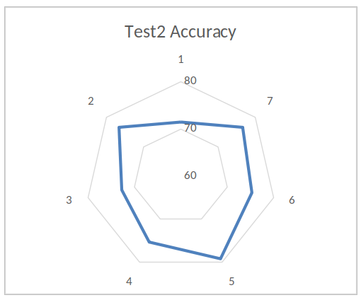
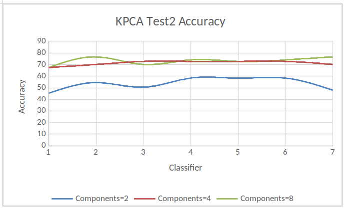
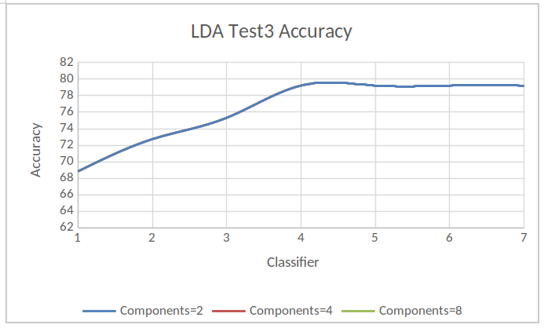

# Motivation
Last election results are very interesting, and several states have surprising 
result . Most of the media had the wrong prectication. Moreover, in the last 
few years, the western countries have had several elections that have 
unexpected results too. We want to know if the same social values exist among 
western countries that would influence the election results.

# Problem
Can we use the data under following categories: Economics, Political 
affiliation (also known as political party), and Background or Social Media - 
to train a model which can use to predict the election results? Does the 
western world have similar social values that affect the elections? Is there a 
correlation between the results of elections and economics, background, or 
social media? 

We expect it is complicated project which involves a lot of 
features, data collecting, and pre-processing. We expect that our model can 
give us some idea about people’s preferences on the candidates and their raised
issues. If our model can also work on other western countries, then we may be 
able to conclude that the social values are same among some countries. 

# Proposed Solution
We want to use our data to see if we can create a model to predict whether or 
not the republican candidate will win the election. We randomly picked 
Republican, our choice has nothing to do with our own affiliations. We are 
separating the election into only Republican and Democratic. A description of 
all our desired attributes/features is at the end of the document.

We want to use SVM to create our model because the data is not linearly 
separable. It has more dependent features. We will also be using other 
classification algorithms to compare.

# US Dataset Shape

# Testing
We tested our dataset using different classifiers (i.e. Perceptron, Decision 
Tree, KNN, Logistic Regression, SVM, and SGD) and compare their results.

We performed following tests without dimension reductions by changing different
parameters.

Note: We also performed the same tests by using dimension reductions 
techniques by modifying number of components.

## Test1
### Parameters
```
per = Perceptron(n_iter=50, eta0=.1, random_state=1)

clf_entropy = DecisionTreeClassifier(criterion="entropy", random_state=1, max\_depth=5, min_samples_leaf=3)

knnn = KNeighborsClassifier(n_neighbors=9, metric='euclidean')#how did i choose

logreg = LogisticRegression(multi_class='auto')

clf1 = svm.SVC(kernel="linear", random_state=1, C=1)

clf2 = svm.SVC(gamma='scale', C = 1.0)

sgd = linear_model.SGDClassifier(max_iter=100, tol=1e-3)
```

### Results
#### Key
|ID | Classifier    |
|---|---------------|
| 1 | Perceptron    |
| 2 | Decision Tree |
| 3 | KNN           |
| 4 | LR            |
| 5 | SVM-L         |
| 6 | SCm-NL        |
| 7 | SGD           |


## Test2
### Parameters
```
per = Perceptron(n_iter=100, eta0=.1, random_state=1)

clf_entropy = DecisionTreeClassifier(criterion="entropy", random_state=1, max_depth=10, min_samples_leaf=5)

knnn = KNeighborsClassifier(n_neighbors=9, weights='uniform', algorithm='auto', leaf_size=30)

logreg = LogisticRegression(warm_start=True, n_jobs=5, max_iter=100, C=2)

clf1 = svm.SVC(kernel="linear", random_state=1, C=2, degree=3, class_weight='balanced')

clf2 = svm.SVC(gamma='scale', C=2, degree=3, class_weight='balanced')

sgd = linear_model.SGDClassifier(max_iter=100, tol=1e-3, alpha=0.0002, shuffle=True)
```

### Results
#### Key
|ID | Classifier    |
|---|---------------|
| 1 | Perceptron    |
| 2 | Decision Tree |
| 3 | KNN           |
| 4 | LR            |
| 5 | SVM-L         |
| 6 | SCm-NL        |
| 7 | SGD           |







    
## Test3:
### Parameters
```
per = Perceptron(n_iter=100, eta0=.2, random_state=1)

clf_entropy = DecisionTreeClassifier(criterion="entropy", random_state=1, max_depth=15, min_samples_leaf=10)

knnn = KNeighborsClassifier(n_neighbors=9, weights='uniform', algorithm='auto', leaf_size=50)

logreg = LogisticRegression(warm_start=True, n_jobs=10, max_iter=200, C=5)

clf1 = svm.SVC(kernel="linear", random_state=1, C=5, degree=5, class_weight='balanced')

clf2 = svm.SVC(gamma='scale', C=5, degree=5, class_weight='balanced')

sgd = linear_model.SGDClassifier(max_iter=200, tol=1e-3, alpha=0.0004, shuffle=False)
```
 
### Results
#### Key
|ID | Classifier    |
|---|---------------|
| 1 | Perceptron    |
| 2 | Decision Tree |
| 3 | KNN           |
| 4 | LR            |
| 5 | SVM-L         |
| 6 | SCm-NL        |
| 7 | SGD           |





# Appendix
## Datasets
Poverty rate in France from 2000 to 2015

https://www.statista.com/statistics/460446/poverty-rate-france/

Unemployment rate in France from 2005 to 2015

https://www.statista.com/statistics/459862/unemployment-rate-france/

Average annual wages in France from 2000 to 2015

https://www.statista.com/statistics/416204/average-annual-wages-france-y-on-y-in-euros/

inflation rate France

https://knoema.com/atlas/France/Inflation-rate

France Stock Exchange 

https://www.macrotrends.net/2596/cac-40-index-france-historical-chart-data

Share of the urban population in France from 2005 to 2015

https://www.statista.com/statistics/466415/share-urban-population-france/

France GDP

https://countryeconomy.com/gdp/france?year=2015

USA Election Campaign Spending

https://www.huffingtonpost.com/entry/56-years-of-presidential-campaign-spending-how-2016_us_5820bf9ce4b0334571e09fc1

USA Inflation Rate

https://www.inflation.eu/inflation-rates/united-states/historic-inflation/cpi-inflation-united-states.aspx

USA Stock Market Performance %

https://www.macrotrends.net/1320/nasdaq-historical-chart

USA Unemployment Rate

https://data.bls.gov/map/MapToolServlet

USA Poverty Rate

https://www.statista.com/search/?q=poverty+rate&language=0&p=1
